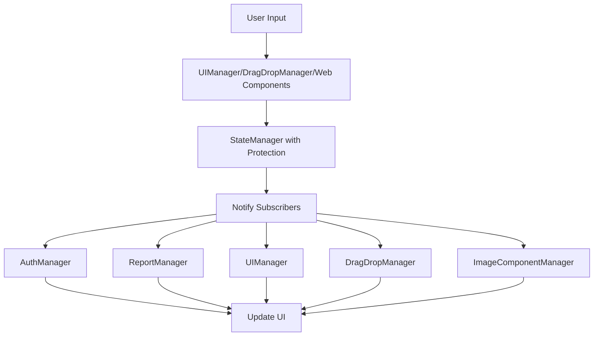
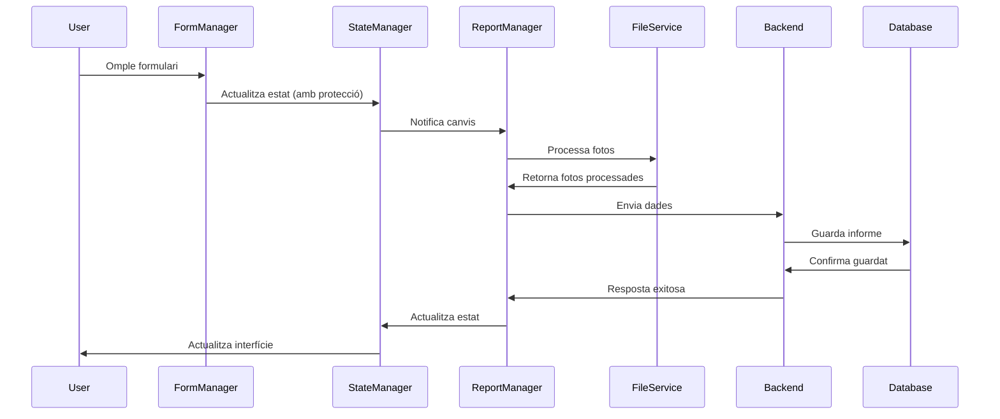

# Arquitectura del Sistema

## Llicència i Propietat Intel·lectual

Aquest projecte està llicenciat sota la **Apache License 2.0**. Vegeu el fitxer [LICENSE](../LICENSE) per a més detalls.

### Desenvolupament amb IA
Aquest codi ha estat desenvolupat amb l'assistència d'intel·ligència artificial. L'autor manté tots els drets sobre el codi final i la implementació específica.

## Visió General de l'Arquitectura

L'aplicació d'informes fotogràfics està dissenyada seguint una arquitectura modular moderna amb separació clara de responsabilitats.

## 📋 Visió General

L'aplicació **Informe Fotogràfic** utilitza una arquitectura modular moderna basada en:
- **Frontend**: JavaScript ES6+ amb mòduls natius i Web Components
- **Backend**: Node.js amb Express.js i arquitectura RESTful
- **Base de Dades**: SQLite per simplicitat i portabilitat
- **Autenticació**: JWT amb tokens d'accés i refresc

## 🎯 Principis Arquitectònics

### 1. Separació de Responsabilitats (SRP)
Cada mòdul té una responsabilitat específica i ben definida:
- **StateManager**: Gestió d'estat centralitzada amb protecció anti-bucles
- **AuthManager**: Autenticació i perfils d'usuari
- **ReportManager**: CRUD d'informes fotogràfics
- **UIManager**: Interfície d'usuari i modals
- **DragDropManager**: Drag & drop centralitzat
- **PhotoComponentManager**: Gestió de components de fotos
- **ImageComponentManager**: Gestió de web components d'imatges
- **FileService**: Processament de fitxers

### 2. Inversió de Dependències (DI)
Els mòduls reben les seves dependències via injecció al constructor:
```javascript
class ReportManager {
    constructor(stateManager, notificationManager, photoComponentManager, fileService, authManager, imageComponentManager) {
        this.stateManager = stateManager;
        this.notificationManager = notificationManager;
        this.photoComponentManager = photoComponentManager;
        this.fileService = fileService;
        this.authManager = authManager;
        this.imageComponentManager = imageComponentManager;
    }
}
```

### 3. Patró Observer amb Protecció Anti-bucles
Sistema reactiu basat en subscripcions per mantenir la UI sincronitzada:
```javascript
// Subscripció a canvis d'estat amb protecció
stateManager.withStateUpdate(() => {
    stateManager.set('shield', shieldData);
    // Aquest canvi no provocarà bucles recursius
});

// Subscripció a canvis d'estat
stateManager.subscribe('user.isAuthenticated', (isAuth) => {
    uiManager.updateAuthUI(isAuth);
});

stateManager.subscribe('shield', (shieldData) => {
    imageComponentManager.updateShieldUI(shieldData);
});
```

### 4. Centralització de Configuració
Tota la configuració es gestiona des d'un punt central:
```javascript
// config/config.js
export const config = {
    server: { port: 33333 },
    files: { maxSize: 20MB },
    jwt: { accessTokenExpiry: '15m' }
};
```

### 5. Centralització d'Utilitats (Millora Gener 2025)
Les funcions comunes s'han centralitzat en serveis especialitzats:
```javascript
// utils/fileService.js - Funcions centralitzades
class FileService {
    static async fileToBase64(file) { /* ... */ }
    static base64ToFile(base64, filename, mimeType) { /* ... */ }
    static ensurePhotoIds(photos) { /* ... */ } // Abans duplicada
}
```

**Millores implementades:**
- **Eliminació de duplicació**: `ensurePhotoIds` estava duplicada en `jsonLoader.js` i `reportManager.js`
- **Funcions no utilitzades**: `isRealFile` eliminada de `formManager.js`
- **Logs de debug**: Eliminats de tots els mòduls per a producció
- **Codi net**: Preparat per a producció sense elements innecessaris

### 6. Sistema de Web Components Unificat (Millora Gener 2025)
S'ha implementat un sistema de web components per unificar la gestió d'imatges:
```javascript
// components/ImageUploadComponent.js - Web component reutilitzable
class ImageUploadComponent extends HTMLElement {
    constructor() {
        super();
        this.attachShadow({ mode: 'open' });
        // Configuració via atributs
        this.title = this.getAttribute('title') || 'Imatge';
        this.acceptTypes = this.getAttribute('accept-types') || 'image/jpeg,image/png';
        this.placeholder = this.getAttribute('placeholder') || 'Arrossega una imatge o fes clic per seleccionar';
    }
    
    // Events personalitzats
    _dispatchFileSelected(file) {
        this.dispatchEvent(new CustomEvent('file-selected', {
            detail: { file },
            bubbles: true
        }));
    }
}
```

**Avantatges implementats:**
- **Reutilització**: Un sol component per a escut, imatge de fons i perfils
- **Encapsulació**: Shadow DOM per aïllar estils i comportament
- **Configuració**: Atributs per personalitzar cada instància
- **Events estandarditzats**: `file-selected`, `file-removed`, `error`
- **Drag & Drop integrat**: Funcionalitat completa dins del component

### 7. Sistema de Logging Centralitzat (Millora Gener 2025)
S'ha implementat un sistema professional de logging amb detecció d'entorn:
```javascript
// utils/errorHandler.js - Sistema de logging centralitzat
export class EnvironmentUtils {
    static isDevelopment() { 
        return process.env.NODE_ENV === 'development' || 
               window.location.hostname === 'localhost' ||
               window.location.hostname === '127.0.0.1';
    }
    static isProduction() { 
        return process.env.NODE_ENV === 'production' && 
               !this.isDevelopment();
    }
    static isTest() { 
        return process.env.NODE_ENV === 'test';
    }
}

export class Logger {
    static info(message, data = {}) { 
        if (EnvironmentUtils.isDevelopment()) {
            console.log(`[INFO] ${message}`, data);
        }
    }
    static warn(message, data = {}) { 
        if (EnvironmentUtils.isDevelopment()) {
            console.warn(`[WARN] ${message}`, data);
        }
    }
    static error(message, error = null) { 
        console.error(`[ERROR] ${message}`, error);
    }
    static debug(message, data = {}) { 
        if (EnvironmentUtils.isDevelopment()) {
            console.log(`[DEBUG] ${message}`, data);
        }
    }
}
```

**Millores implementades:**
- **Detecció automàtica d'entorn**: Logs de debug només en desenvolupament
- **Format consistent**: `[NIVELL] Missatge` amb timestamps
- **Context estructurat**: Dades organitzades per a cada log
- **Storage local**: Logs guardats a `localStorage` per debugging

### 8. Protecció d'Estats Anti-bucles (Millora Gener 2025)
Sistema per prevenir bucles recursius en actualitzacions d'estat:
```javascript
// modules/stateManager.js - Protecció anti-bucles
class StateManager {
    constructor() {
        this.state = {};
        this.listeners = {};
        this.isUpdatingFromState = false;
    }
    
    startStateUpdate() {
        this.isUpdatingFromState = true;
    }
    
    endStateUpdate() {
        this.isUpdatingFromState = false;
    }
    
    withStateUpdate(callback) {
        this.startStateUpdate();
        try {
            callback();
        } finally {
            this.endStateUpdate();
        }
    }
    
    set(path, value) {
        if (this.isUpdatingFromState) {
            return; // Prevenir bucles recursius
        }
        // ... resta de la lògica
    }
}
```

**Avantatges implementats:**
- **Prevenció d'errors**: Evita "Maximum call stack size exceeded"
- **Gestió centralitzada**: Control del flag al `stateManager`
- **Mètodes segurs**: `startStateUpdate()`, `endStateUpdate()`, `withStateUpdate()`
- **Consistència**: Ús unificat a tota l'aplicació

## 🏛️ Arquitectura Frontend

### Estructura de Mòduls Actualitzada

```
public/js/
├── app.js                 # Punt d'entrada i orquestració DI
├── modules/               # Mòduls principals
│   ├── stateManager.js    # Estat centralitzat (Singleton + Observer + Protecció)
│   ├── authManager.js     # Autenticació i perfils
│   ├── reportManager.js   # Gestió d'informes CRUD
│   ├── uiManager.js       # Interfície d'usuari i modals
│   ├── formManager.js     # Gestió de formularis
│   ├── photoComponentManager.js # Components de fotos
│   ├── imageComponentManager.js # Gestió de web components d'imatges
│   ├── dragDropManager.js # Drag & Drop centralitzat amb Mixin
│   ├── jsonLoader.js      # Importació/Exportació JSON
│   └── notificationManager.js # Sistema de notificacions
├── utils/                 # Serveis utilitaris
│   ├── validationService.js # Validació centralitzada
│   ├── fileService.js     # Processament de fitxers
│   ├── pdfGenerator.js    # Generació de PDFs
│   ├── errorHandler.js    # Gestió d'errors robusta + Logger + EnvironmentUtils
│   ├── dateTimeService.js # Serveis de data/hora
│   ├── sanitizer.js       # Sanitització de dades
│   └── dragDropMixin.js   # Mixin reutilitzable per drag & drop
└── components/            # Web Components
    ├── FotoComponent.js   # Component personalitzat de foto
    └── ImageUploadComponent.js # Component unificat per imatges
```

### 🔄 Millores en l'Organització del Drag & Drop

#### Abans (Problemàtic):
- **4 mòduls diferents** gestionaven drag & drop
- **Duplicació de codi** entre `UIManager`, `EventManager`, `PhotoComponentManager`
- **Responsabilitats disperses** i confuses
- **Mòduls no utilitzats** (`EventManager`)

#### Ara (Optimitzat):
- **1 mòdul centralitzat** (`DragDropManager`) gestiona tot el drag & drop
- **DragDropMixin reutilitzable** per compartir funcionalitats
- **Web Components** amb drag & drop encapsulat
- **Eliminació de duplicació** de codi
- **Responsabilitats clares** per cada mòdul
- **Patrons consistents** amb la resta del projecte

```javascript
// DragDropManager - Responsabilitat única
class DragDropManager {
    constructor(stateManager, uiManager, photoComponentManager, notificationManager) {
        // Dependency Injection - Tots els serveis injectats
        this.stateManager = stateManager;
        this.uiManager = uiManager;
        this.photoComponentManager = photoComponentManager;
        this.notificationManager = notificationManager;
    }
    
    init() {
        this.setupStateSubscriptions(); // Observer pattern
        this.setupAllDragAndDrop();     // Configuració centralitzada
    }
    
    setupStateSubscriptions() {
        // Subscripcions a canvis d'estat
        this.stateManager.subscribe('shield', this.updateShieldUI.bind(this));
        this.stateManager.subscribe('photos', this.updatePhotosUI.bind(this));
    }
}

// DragDropMixin - Codi reutilitzable
export class DragDropMixin {
    static setupDragDrop(element, options) {
        // Configuració unificada per a tots els elements
        element.addEventListener('dragover', (e) => {
            e.preventDefault();
            element.classList.add('drag-over');
        });
        
        element.addEventListener('drop', (e) => {
            e.preventDefault();
            element.classList.remove('drag-over');
            const files = Array.from(e.dataTransfer.files);
            if (options.onFileSelect) {
                options.onFileSelect(files);
            }
        });
    }
    
    static setupFileInputClick(element, fileInput, options) {
        // Gestió unificada de clicks
        element.addEventListener('click', () => {
            fileInput.click();
        });
    }
}
```

### Patrons de Disseny Implementats

#### 1. Singleton Pattern (StateManager)
```javascript
class StateManager {
    constructor() {
        this.state = {};
        this.listeners = []; // Gestió de subscripcions
        this.globalListeners = [];
        this.isUpdatingFromState = false; // Protecció anti-bucles
    }
    
    subscribe(path, callback) {
        if (!this.listeners[path]) {
            this.listeners[path] = [];
        }
        this.listeners[path].push(callback);
    }
}
```

#### 2. Observer Pattern (Sistema Reactiu)
```javascript
class StateManager {
    set(path, value) {
        if (this.isUpdatingFromState) {
            return; // Prevenir bucles recursius
        }
        
        const oldValue = this.get(path);
        this._setNestedValue(this.state, path, value);
        this.notifyListeners(path, oldValue, value);
    }
    
    notifyListeners(path, oldValue, value) {
        if (this.listeners[path]) {
            this.listeners[path].forEach(callback => callback(value, oldValue));
        }
    }
}
```

#### 3. Factory Pattern (FileService)
```javascript
class FileService {
    static async processImageFiles(files, options = {}) {
        const processedFiles = [];
        for (const file of files) {
            const processor = this.createProcessor(file.type);
            const processedFile = await processor.process(file, options);
            processedFiles.push(processedFile);
        }
        return processedFiles;
    }
}
```

#### 4. Command Pattern (ReportManager)
```javascript
class ReportManager {
    async handleGeneratePdf() {
        const reportData = await this._collectReportDataAsync();
        const command = new GeneratePdfCommand(reportData);
        await command.execute();
    }
}
```

#### 5. Web Components Pattern
```javascript
// components/ImageUploadComponent.js
class ImageUploadComponent extends HTMLElement {
    constructor() {
        super();
        this.attachShadow({ mode: 'open' });
        this._setupDragDrop();
        this._setupFileInput();
    }
    
    _setupDragDrop() {
        // Utilitzar DragDropMixin per consistència
        DragDropMixin.setupDragDrop(this.shadowRoot.querySelector('.drop-zone'), {
            onFileSelect: this._handleFileSelect.bind(this),
            validation: this._validateFile.bind(this)
        });
    }
}
```

#### 6. Mixin Pattern (DragDropMixin)
```javascript
// utils/dragDropMixin.js
export class DragDropMixin {
    static setupDragDrop(element, options) {
        // Funcionalitats comunes de drag & drop
        element.addEventListener('dragover', (e) => {
            e.preventDefault();
            element.classList.add('drag-over');
        });
        
        element.addEventListener('drop', (e) => {
            e.preventDefault();
            element.classList.remove('drag-over');
            const files = Array.from(e.dataTransfer.files);
            if (options.onFileSelect) {
                options.onFileSelect(files);
            }
        });
    }
}
```

### Flux de Dades Actualitzat

1. **Entrada d'Usuari** → Mòdul específic (UIManager, DragDropManager, Web Components)
2. **Mòdul** → StateManager (actualització d'estat amb protecció)
3. **StateManager** → Notifica subscriptors via Observer
4. **Subscriptors** → Actualitzen la interfície reactiva



### 🎯 Funcionalitats del DragDropManager

#### Zones de Drop Gestionades:
1. **Zona de fotos** (`#drop-zone`) - Accepta múltiples imatges
2. **Web Components d'imatges** (`image-upload`) - Gestió unificada via DragDropMixin
3. **Zona de previsualització** (`#preview-section`) - Reordenació de components

#### DragDropMixin Unificat:
```javascript
// utils/dragDropMixin.js - Codi reutilitzable
export class DragDropMixin {
    static setupDragDrop(element, options) {
        // Configuració unificada per a tots els elements
        element.addEventListener('dragover', (e) => {
            e.preventDefault();
            element.classList.add('drag-over');
        });
        
        element.addEventListener('drop', (e) => {
            e.preventDefault();
            element.classList.remove('drag-over');
            const files = Array.from(e.dataTransfer.files);
            if (options.onFileSelect) {
                options.onFileSelect(files);
            }
        });
    }
    
    static setupFileInputClick(element, fileInput, options) {
        // Gestió unificada de clicks
        element.addEventListener('click', () => {
            fileInput.click();
        });
    }
}
```

**Avantatges:**
- **Codi reutilitzable**: Lògica compartida entre components
- **Validació centralitzada**: Regles unificades per a fitxers
- **Gestió d'errors**: Handling consistent d'errors
- **Performance**: Optimitzacions per a múltiples fitxers
- **Consistència**: Mateix comportament a tota l'aplicació

#### Funcionalitats Implementades:
- ✅ **Drag & Drop de fotos** amb validació
- ✅ **Drag & Drop d'escut i fons** amb previsualització
- ✅ **Click per seleccionar** fitxers d'escut
- ✅ **Reordenació visual** de components de fotos
- ✅ **Prevenció global** de drag & drop no desitjat
- ✅ **Validació centralitzada** de fitxers
- ✅ **Gestió d'errors** robusta
- ✅ **Web Components** amb drag & drop encapsulat

```javascript
// Exemple d'ús integrat
async handleShieldDrop(file) {
    // Validació
    const validation = ValidationService.validateFile(file, {
        maxSize: 5 * 1024 * 1024,
        allowedTypes: ['image/jpeg', 'image/png']
    });
    
    if (!validation.isValid) {
        this.notificationManager.error(`Error: ${validation.errors.join(', ')}`);
        return;
    }
    
    // Processament
    await this.processShieldFile(file);
    
    // Actualització d'estat (Observer) amb protecció
    this.stateManager.withStateUpdate(() => {
    this.stateManager.set('shield', {
        file: file,
        url: URL.createObjectURL(file)
        });
    });
}
```

## 🚀 Arquitectura Backend

### Estructura de Serveis

```
├── index.js              # Punt d'entrada del servidor
├── auth/                 # Mòdul d'autenticació
│   ├── controllers/      # Lògica de negoci
│   ├── middleware/       # Validació i autenticació
│   ├── routes/           # Definició de rutes
│   └── utils/            # Utilitats JWT i passwords
├── reports/              # Mòdul d'informes
│   ├── controllers/      # CRUD d'informes
│   └── routes/           # Rutes d'informes
├── database/             # Capa de dades
│   ├── database.js       # Connexió i queries
│   └── init.js           # Inicialització
├── middleware/           # Middleware global
│   ├── loggingMiddleware.js
│   ├── monitoringMiddleware.js
│   └── jsonReportHandler.js
├── utils/                # Utilitats del servidor
│   ├── logger.js         # Sistema de logging
│   ├── monitor.js        # Monitorització
│   └── errorHandler.js   # Gestió d'errors
└── config/               # Configuració
    └── config.js         # Configuració centralitzada
```

### Patrons de Disseny Backend

#### 1. MVC (Model-View-Controller)
```javascript
// Controller
export const authController = {
    async login(req, res) {
        try {
            const { email, password } = req.body;
            const user = await UserModel.findByEmail(email);
            // Lògica de negoci
            res.json({ user, token });
        } catch (error) {
            res.status(500).json({ error: error.message });
        }
    }
};

// Routes (View layer)
router.post('/login', authController.login);
```

#### 2. Repository Pattern
```javascript
class Database {
    async queryOne(sql, params) {
        // Implementació específica de SQLite
    }
    
    async query(sql, params) {
        // Implementació específica de SQLite
    }
}

// Ús del repository
const user = await database.queryOne('SELECT * FROM users WHERE email = ?', [email]);
```

#### 3. Middleware Pattern
```javascript
// Middleware d'autenticació
export async function authMiddleware(req, res, next) {
    const token = TokenUtils.extractTokenFromHeader(req.headers.authorization);
    const user = await TokenUtils.verifyToken(token);
    req.user = user;
    next();
}

// Ús del middleware
router.get('/profile', authMiddleware, profileController.getProfile);
```

#### 4. Decorator Pattern (Logging)
```javascript
export const asyncHandler = (fn) => {
    return (req, res, next) => {
        Promise.resolve(fn(req, res, next)).catch(next);
    };
};

// Ús del decorator
router.post('/reports', asyncHandler(reportsController.createReport));
```

## 🗄️ Arquitectura de Base de Dades

### Esquema de Taules

```sql
-- Usuaris
CREATE TABLE users (
    id INTEGER PRIMARY KEY AUTOINCREMENT,
    email TEXT UNIQUE NOT NULL,
    password_hash TEXT NOT NULL,
    name TEXT NOT NULL,
    role TEXT DEFAULT 'user',
    created_at DATETIME DEFAULT CURRENT_TIMESTAMP,
    is_active BOOLEAN DEFAULT 1
);

-- Informes
CREATE TABLE reports (
    id INTEGER PRIMARY KEY AUTOINCREMENT,
    user_id INTEGER NOT NULL,
    title TEXT NOT NULL,
    report_data TEXT NOT NULL, -- JSON
    created_at DATETIME DEFAULT CURRENT_TIMESTAMP,
    updated_at DATETIME DEFAULT CURRENT_TIMESTAMP,
    FOREIGN KEY (user_id) REFERENCES users (id)
);

-- Perfils d'usuari
CREATE TABLE user_profiles (
    id INTEGER PRIMARY KEY AUTOINCREMENT,
    user_id INTEGER NOT NULL,
    signants TEXT,
    shield TEXT, -- Base64
    backgroundImage TEXT, -- Base64
    signatureImage TEXT, -- Base64
    FOREIGN KEY (user_id) REFERENCES users (id)
);

-- Tokens revocats
CREATE TABLE revoked_tokens (
    id INTEGER PRIMARY KEY AUTOINCREMENT,
    token TEXT UNIQUE NOT NULL,
    user_id INTEGER NOT NULL,
    revoked_at DATETIME DEFAULT CURRENT_TIMESTAMP,
    FOREIGN KEY (user_id) REFERENCES users (id)
);
```

### Patrons de Dades

#### 1. Single Table Inheritance
Els informes guarden totes les dades en un camp JSON:
```javascript
const reportData = {
    general: {
        tipus: 'Accident',
        numero: '2025/001',
        // ... altres camps
    },
    photos: [
        {
            id: 1,
            titol: 'Vista general',
            descripcio: 'Descripció de la foto',
            imageUrl: 'data:image/jpeg;base64,...',
            isActive: true
        }
    ]
};

// Guardat a la base de dades
await database.run(
    'INSERT INTO reports (user_id, title, report_data) VALUES (?, ?, ?)',
    [userId, title, JSON.stringify(reportData)]
);
```

#### 2. Soft Delete
Els usuaris es desactiven en lloc d'eliminar-se:
```sql
UPDATE users SET is_active = 0 WHERE id = ?;
```

#### 3. Audit Trail
Tracking de canvis amb timestamps:
```sql
UPDATE reports SET 
    report_data = ?, 
    updated_at = CURRENT_TIMESTAMP 
WHERE id = ?;
```

## 🔐 Arquitectura de Seguretat

### Autenticació JWT

```javascript
// Generació de tokens
const payload = {
    userId: user.id,
    email: user.email,
    role: user.role
};

const accessToken = jwt.sign(payload, ACCESS_SECRET, { expiresIn: '15m' });
const refreshToken = jwt.sign(payload, REFRESH_SECRET, { expiresIn: '7d' });
```

### Middleware de Seguretat

```javascript
// Headers de seguretat
app.use(helmet({
    contentSecurityPolicy: {
        directives: {
            defaultSrc: ["'self'"],
            scriptSrc: ["'self'", "'unsafe-inline'"],
            styleSrc: ["'self'", "'unsafe-inline'"],
            imgSrc: ["'self'", "data:", "blob:"]
        }
    }
}));

// Rate limiting
const limiter = rateLimit({
    windowMs: 15 * 60 * 1000, // 15 minuts
    max: 100 // màxim 100 peticions
});
```

### Validació i Sanitització

```javascript
// Validació d'entrada
export const validateLogin = (req, res, next) => {
    const { email, password } = req.body;
    
    if (!email || !password) {
        return res.status(400).json({ error: 'Camps obligatoris' });
    }
    
    if (!/^[^\s@]+@[^\s@]+\.[^\s@]+$/.test(email)) {
        return res.status(400).json({ error: 'Email invàlid' });
    }
    
    next();
};
```

## 📊 Arquitectura de Monitorització

### Sistema de Logging

```javascript
class Logger {
    constructor() {
        this.logLevels = { ERROR: 0, WARN: 1, INFO: 2, DEBUG: 3 };
        this.logDir = path.join(__dirname, '../logs');
    }
    
    writeLog(level, message, context = {}) {
        const logEntry = {
            timestamp: new Date().toISOString(),
            level,
            message,
            context: {
                ...context,
                pid: process.pid,
                memory: process.memoryUsage()
            }
        };
        
        fs.appendFileSync(
            path.join(this.logDir, `${level.toLowerCase()}.log`),
            JSON.stringify(logEntry) + '\n'
        );
    }
}
```

### Sistema de Monitorització

```javascript
class Monitor {
    constructor() {
        this.metrics = {
            requests: { total: 0, success: 0, errors: 0 },
            performance: { responseTimes: [], memoryUsage: [] },
            business: { reportsGenerated: 0, usersActive: 0 }
        };
    }
    
    trackRequest(method, path, statusCode, duration) {
        this.metrics.requests.total++;
        
        if (statusCode >= 200 && statusCode < 400) {
            this.metrics.requests.success++;
        } else {
            this.metrics.requests.errors++;
        }
        
        this.metrics.performance.responseTimes.push(duration);
    }
}
```

## 🔄 Flux de Dades Complet

### Creació d'un Informe

1. **Frontend**: Usuari omple el formulari
2. **FormManager**: Valida les dades
3. **StateManager**: Actualitza l'estat (amb protecció anti-bucles)
4. **ReportManager**: Processa les fotos
5. **FileService**: Redimensiona i optimitza imatges
6. **ReportManager**: Envia dades al backend
7. **Backend**: Valida i guarda a la base de dades
8. **Frontend**: Actualitza la interfície



## 🛠️ Patrons de Gestió d'Errors

### Frontend Error Boundary

```javascript
export class ErrorBoundary {
    static handleError(error, context, operation) {
        // Log de l'error amb sistema centralitzat
        Logger.error(`Error in ${operation}`, {
            error: error.message,
            stack: error.stack,
            context,
            timestamp: new Date().toISOString()
        });
        
        // Notificar l'usuari
        this.showUserFriendlyError(error, context);
        
        // Enviar al servidor
        this.logErrorToServer(error, context);
    }
}
```

### Backend Error Handling

```javascript
export const errorHandler = (err, req, res, next) => {
    // Log de l'error
    logger.error('Unhandled error', {
        method: req.method,
        path: req.path,
        error: err.message,
        stack: err.stack
    });
    
    // Resposta estandarditzada
    res.status(err.statusCode || 500).json({
        success: false,
        error: err.message || 'Error intern del servidor',
        ...(process.env.NODE_ENV === 'development' && { stack: err.stack })
    });
};
```

## 📈 Mètriques de Rendiment

### Objectius de Rendiment

- **Temps de càrrega inicial**: < 2 segons
- **Temps de resposta API**: < 200ms (mitjana)
- **Processament d'imatges**: < 1 segon per imatge
- **Generació de PDF**: < 3 segons

### Optimitzacions Implementades

1. **Compressió d'imatges** automàtica
2. **Lazy loading** de components
3. **Caching** de recursos estàtics
4. **Minificació** de fitxers CSS/JS
5. **Connection pooling** per a la base de dades
6. **Web Components** amb Shadow DOM per aïllament
7. **DragDropMixin** per reutilització de codi

## 🔮 Arquitectura Futura

### Millores Planificades

1. **Microserveis**: Dividir en serveis independents
2. **Cache distribuït**: Redis per a sessions i dades
3. **Queue system**: Per a processament asíncron
4. **CDN**: Per a distribució de recursos estàtics
5. **Containerització**: Docker per a desplegament
6. **Web Components addicionals**: Per a altres elements de la UI
7. **Sistema de plugins**: Per a funcionalitats extensibles

### Escalabilitat

```javascript
// Exemple d'arquitectura de microserveis
const services = {
    auth: 'http://auth-service:3001',
    reports: 'http://reports-service:3002',
    files: 'http://files-service:3003',
    notifications: 'http://notifications-service:3004'
};
```

---

*Documentació d'arquitectura actualitzada: Juliol 2025* 